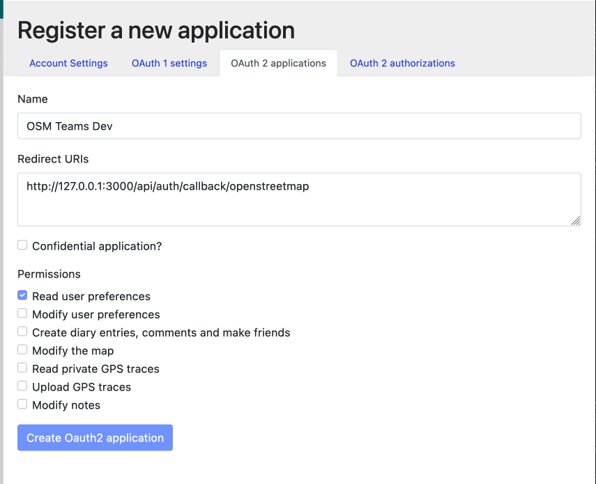

# osm-teams 🤝

<div>
  <a href="https://circleci.com/gh/developmentseed/osm-teams">
    
  </a>
  <a href="https://standardjs.com">
    
  </a>
  <a href="http://validator.swagger.io/validator/debug?url=https://raw.githubusercontent.com/developmentseed/osm-teams/master/docs/api.yml">
    
  </a>
  </div>

## Development

Install requirements:

- [nvm](https://github.com/creationix/nvm)
- [Docker](https://www.docker.com)

Visit your [OpenStreetMap settings](https://www.openstreetmap.org/account/edit) page and [register an OAuth2 app](https://www.openstreetmap.org/oauth2/applications) :



Create an `.env` file and add environment variables `OSM_CONSUMER_KEY` and `OSM_CONSUMER_SECRET` obtained at OAuth2 page at OpenStreetMap website. The .env file should be like the following:

    ```bash
    OSM_CONSUMER_KEY=<osm-oauth2-client-id>
    OSM_CONSUMER_SECRET=<osm-oauth2-client-secret>
    ```

Start development and test databases with Docker:

    docker-compose up --build

Install Node.js the required version (see [.nvmrc](.nvmrc) file):

    nvm i

Install Node.js modules:

    yarn

Migrate `dev-db` database:

    yarn migrate

Start development server:

    yarn dev

<!-- markdownlint-disable MD034 -->
✨ You can now login to the app at http://127.0.0.1:3000
<!-- markdownlint-enable MD034 -->

## Acknowledgments

- This app is based off of [OSM/Hydra](https://github.com/kamicut/osmhydra)

## LICENSE

[MIT](LICENSE)
