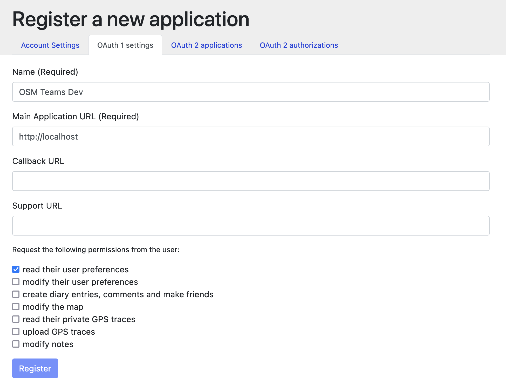

# osm-teams 🤝

<div>
  <a href="https://circleci.com/gh/developmentseed/osm-teams">
    
  </a>
  <a href="https://standardjs.com">
    
  </a>
  <a href="http://validator.swagger.io/validator/debug?url=https://raw.githubusercontent.com/developmentseed/osm-teams/master/docs/api.yml">
    
  </a>
  </div>

Check the beta 👉 <!-- markdownlint-disable MD034 -->https://mapping.team
<!-- markdownlint-enable MD034 -->

## Development

Install requirements:

- [nvm](https://github.com/creationix/nvm)
- [Docker](https://www.docker.com)

Visit your [OpenStreetMap settings](https://www.openstreetmap.org/account/edit) page and register an OAuth1 Client App:



Create an `.env` file by copying `.env.sample` and replacing the values as needed. `OSM_CONSUMER_KEY` and `OSM_CONSUMER_SECRET` are values available at the OAuth app page on openstreetmap.org. The .env file should contain:

    ```bash
    OSM_CONSUMER_KEY=<osm-teams-app>
    OSM_CONSUMER_SECRET=<osm-teams-app-secret>
    DSN=postgres://postgres@dev-db/osm-teams?sslmode=disable
    ```

Start Hydra and PostgreSQL with Docker:

    docker-compose -f compose.dev.yml up --build

On a separate terminal, create the [first-party](https://auth0.com/docs/applications/concepts/app-types-first-third-party) "osm-teams" app:

```bash
docker-compose exec hydra hydra clients create --endpoint http://localhost:4445 \
  --id osm-teams \
  --secret osm-teams-secret \
  --response-types code,id_token \
  --grant-types refresh_token,authorization_code \
  --scope openid,offline,clients \
  --callbacks http://localhost:3000/api/auth/callback/openstreetmap
```

Install Node.js the required version (see [.nvmrc](.nvmrc) file):

    nvm i

Install Node.js modules:

    yarn

Migrate `dev-db` database:

    yarn migrate

Start development server:

    yarn dev

<!-- markdownlint-disable MD034 -->
✨ You can now login to the app at http://localhost:3000
<!-- markdownlint-enable MD034 -->

## Acknowledgments

- This app is based off of [OSM/Hydra](https://github.com/kamicut/osmhydra)
